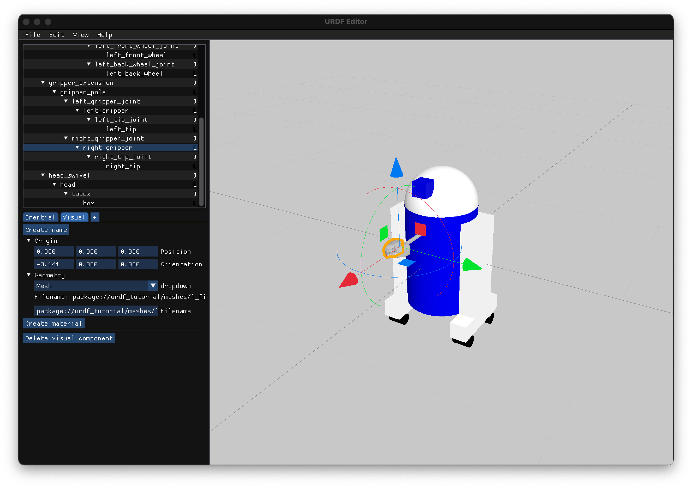

# URDF Editor

This is a work-in-progress WYSIWYG editor that allows you to create, modify and
visualize robots defined with [URDF](http://wiki.ros.org/urdf). The main goal of
this project is to create an editor that does not depend on the ROS software
stack and is platform agnostic, you only need a C++17 compiler.



# Install

All the dependencies are automatically downloaded and compiled with CMake. To
install, simply run:

```bash
git clone https://github.com/noctrog/urdf-editor && cd urdf-editor
cmake -B build -S . -DCMAKE_BUILD_TYPE=Release  # or RelWithDebInfo for debugging
cmake --build build -j$(nproc)
./build/urdf-editor
```

# Roadmap

- [x] Load and save URDF files
- [x] Do/Undo system
- [x] GUI (with ImGui)
- [x] Drag and drop link (GUI URDF Tree)
- [x] 3D Gizmo for visual editing
- [ ] Visualize joint movements
- [ ] Material editor
- [ ] Mesh geometry support (in the works through Assimp)

# Contributing

Contributions are always welcome! Feel free to open an issue or create a merge
request :)
