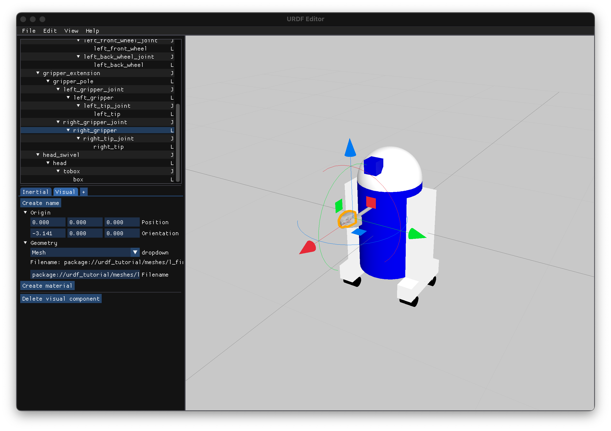

# URDF Editor

This is a WYSIWYG editor that allows you to create, modify and
visualize robots defined with [URDF](http://wiki.ros.org/urdf). The main goal of
this project is to create an editor that does not depend on the ROS software
stack and is platform agnostic, you only need a C++17 compiler.



# Features

- Create new robots or load existing URDF files
- Interactive robot tree with drag-and-drop to reparent joints
- 3D gizmo to visually position links and joints
- Edit joint properties: type, axis, dynamics, limits
- Edit link properties: inertial (mass, inertia tensor), visual, collision
- Multiple collision geometries per link
- Geometry types: box, cylinder, sphere, mesh (`.dae`, `.stl`)
- Full undo/redo for all operations
- Save to URDF

# Install

All C++ dependencies are automatically downloaded and compiled via CMake
FetchContent. You only need a C++17 compiler and CMake 3.10+.

## Linux

Install the required system libraries first:

```bash
sudo apt install pkg-config libgtk-3-dev libxi-dev libxcursor-dev libxinerama-dev libxrandr-dev
```

Then build:

```bash
git clone https://github.com/noctrog/urdf-editor && cd urdf-editor
cmake -B build -S . -DCMAKE_BUILD_TYPE=Release
cmake --build build -j$(nproc)
./build/urdf-editor
```

## macOS

No extra system libraries are needed. Just build with CMake:

```bash
git clone https://github.com/noctrog/urdf-editor && cd urdf-editor
cmake -B build -S . -DCMAKE_BUILD_TYPE=Release
cmake --build build -j$(sysctl -n hw.ncpu)
./build/urdf-editor
```

# Usage

## Camera Controls

| Input                        | Action          |
|------------------------------|-----------------|
| Middle mouse button + drag   | Orbit           |
| Shift + middle mouse + drag  | Pan             |
| Scroll wheel                 | Zoom            |

## Keyboard Shortcuts

| Shortcut             | Action              |
|----------------------|----------------------|
| Ctrl/Cmd + O         | Open URDF file       |
| Ctrl/Cmd + S         | Save URDF file       |
| Ctrl/Cmd + N         | New robot            |
| Ctrl/Cmd + J         | Create joint (when a link is selected) |
| Ctrl/Cmd + Z         | Undo                 |
| Ctrl/Cmd + Y         | Redo                 |
| Ctrl/Cmd + Shift + Z | Redo                 |

# Mesh Path Resolution

URDF files often reference mesh geometries (`.dae`, `.stl`) using different path
styles. The editor resolves them as follows:

- **`package://` paths** (common in ROS): The editor strips the `package://`
  prefix and walks up the directory tree from the URDF file's location until it
  finds a `package.xml`. The remaining path is then resolved relative to that
  package root. This means you don't need ROS installed — as long as your URDF
  sits inside a standard ROS package directory structure, mesh paths will resolve
  correctly.

- **Relative paths**: Resolved relative to the directory containing the URDF
  file.

- **Absolute paths**: Used as-is.

If you're working outside of a ROS workspace, the simplest approach is to place
your mesh files relative to the URDF file and use relative paths in the
`<mesh filename="..."/>` attribute. If your URDF uses `package://` paths, make
sure there is a `package.xml` somewhere in the parent directories above the URDF
file.

You can also change the mesh file at runtime by clicking the `...` button next
to the filename in the Geometry section and selecting a new `.dae` or `.stl`
file.

# Roadmap

- [x] Load and save URDF files
- [x] Do/Undo system
- [x] GUI (with ImGui)
- [x] Drag and drop link (GUI URDF Tree)
- [x] 3D Gizmo for visual editing
- [x] Mesh geometry support
- [ ] Visualize joint movements
- [ ] Material editor

# Contributing

Contributions are always welcome! Feel free to open an issue or create a merge
request :)
